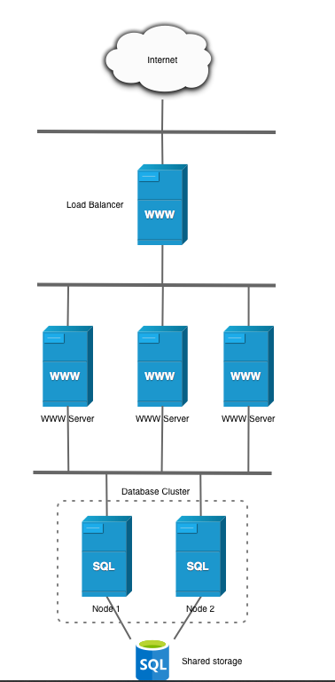

# Práctica-10 Balanceador de carga con apache.


## Explicación del despliegue de un balanceador de carga con apache.

### ¿Qué se ha hecho?
<p>Hemos instalador una maquina que dispone que actua como balanceador de carga.</p>

<p>Estructura del balanceador de carga junto con los servidores frontend y backend:</p>



El ``objetivo`` que la máquina que sale a internet, el balanceador, tenga instalado apache, pero se tiene que instalar para que los diversos frontend que tengamos en la estructura de nuestra red, vayan alternando entre el uno y el otro, empleando el método de Round Robin, actuando los dos servidores frontend de forma conjunta, el balanceador de carga, deberá saber las direcciones ips privadas de los dos frontend, mas adelante se explica el porqué... sin embargo como introducción, viene bien saber que, la dirección pública que se da a internet va a ser la del balanceador, y el servidor apacher del ``balanceador`` previamente configurado por el administrador, se va a encargar de que vaya administrando contenido de los servidores frontend 1 y 2, es decir se van a ir turnando entre los dos, bajo las ordenes del balanceador.

## 1.-Instalación de la pila lamp en el balanceador.
### Pero,¿De que consta una pila LAMP?
Muy simple, con esto describimos un sistema de infraestructura de internet, lo que estamos buscando es desplegar una serie de aplicaciones en la web, desde un unico sistema operativo, esto quiere decir que, buscamos desplegar aplicaciones en la web de forma cómoda y rápida ejecutando un único script, el cual hay que configurar previamente.

### 1. Que representa cada letra de la palabra --> LAMP.

#### L --> Linux (Sistema operativo).
#### A --> Apache (Servidor web).
#### M --> MySQL/MariaDB (Sistema gestor de base de datos).
#### P --> PHP (Lenguaje de programación).

### Con esto, buscamos hacer un despligue de aplicaciones.

## --Script de la pila lamp para el balanceador de carga.

## Muestra todos los comandos que se han ejecutado.

```
set -ex
```

Ademas de que si hubiese un error, pararía el script en el momento en el que ocurre ese error.

## Actualización de repositorios

```
apt update
```

<p>Actualizamos los paquetes, para evitar errores en la instalación de software.</p>

## Invocamos al archivo source .env
<p>Cargamos el fichero .env para traer las variables necesarias al script cargadas desde ese fichero.</p>

```
source .env
```
Es decir:
```
IP_HTTP_SERVER_1=172.31.91.83
IP_HTTP_SERVER_2=172.31.82.43
```

Estas dos variables, las cuales contienen las ips privadas, de los dos servidores frontend.

## Instalamos el servidor Web apache

<p>Ahora vamos a instalar apache, ahora a partir de aquí comenzamos con los pasos proximos para que actúe como balanceador.</p>

```
apt install apache2 -y
```

## Habilitamos los modulos para configurar Apache como proxy apache

Necesitamos hacer que apache actue como un proxy... Pero ¿que es un proxy? Pongamos el caso en el que en una empresa tengamos una serie de equipos los cuales nos interesaría que no pudiesen acceder a cierto contenido en internet, pues el proxy se encarga de eso, el proxy permitirá o denegará cualquier paquete que pase por este, según lo haya configurado el administrador, el balanceador hará su papel como si fuese un proxy.

### Para ello:

```
a2enmod proxy
a2enmod proxy_http
a2enmod proxy_balancer
```

Necesitamos instalar estas tres modalidades de apache basadas en el proxy, donde instalamos el proxy, el proxy_http y el balancer esto va a permitir que las peticiones de los frontend pasen por el balanceador.


## Habilitamos el balanceo de carga round robin.

```
a2enmod lbmethod_byrequests
```

Esto es una modalidad de apache para que el balanceo se pueda realizar mediante round robin.

## Copiamos el archivo de configuracion
Ahora, tenemos que contar con un fichero de configuración creado previamente llamado.

```
<VirtualHost *:80>
    <Proxy balancer://mycluster>
        # Server 1
        BalancerMember http://IP_HTTP_SERVER_1

        # Server 2
        BalancerMember http://IP_HTTP_SERVER_2
    </Proxy>

    ProxyPass / balancer://mycluster/
</VirtualHost>
```

Con esto, estamos configurando el balanceador proxy, el cual configuramos los dos frontend con sus ips privadas.

Donde BalancerMember incluye la ip privada de los frontend.

Las dos variables que van a sustituir ese contenido son:

```
IP_HTTP_SERVER_1=172.31.91.83
IP_HTTP_SERVER_2=172.31.82.43
```

Estas dos de aquí: IMPORTANTE tienen que ser las ips privadas de los dos servidores frontend.

```
cp ../conf/load-balancer.conf /etc/apache2/sites-available
```
Mediante cp cargamos ese fichero de configuración el cual configura el balanceador proxy del balanceador.

## Reemplazo las variables de la plantilla con las direcciones de los frontales.
```
sed -i "s/IP_HTTP_SERVER_1/$IP_HTTP_SERVER_1/" /etc/apache2/sites-available/load-balancer.conf
sed -i "s/IP_HTTP_SERVER_2/$IP_HTTP_SERVER_2/" /etc/apache2/sites-available/load-balancer.conf
```
Reemplazamos las variables:

```
BalancerMember http://IP_HTTP_SERVER_1
BalancerMember http://IP_HTTP_SERVER_2
```
Ahí es donde se van a poner esas direcciones privadas.

## Habilitamos el virtualhost que hemos creado.
```
a2ensite load-balancer.conf
```
Ahora habilitamos el sitio load-balancer.conf, para que muestre el contenido de los dos frontend.
## Deshabilitamos el virtual host por defecto.

```
a2dissite 000-default.conf
```
Teniendo en cuenta que necesitamos mostrar el contenido de los dos frontend a traves del balanceador, necesitamos deshabilitar el sitio por defecto que tiene apache2.

## Reiniciamos
Es necesario reiniciarlos para que se guarden los cambios en el servidor apache.
```
systemctl restart apache2
```

## Comprobaciones del Balanceador.
<p>Muestra de que el round robin funcione.</p>


Si recargamos la pagina, en orden primero mostrará el frontend 1 y luego el frontend2.
